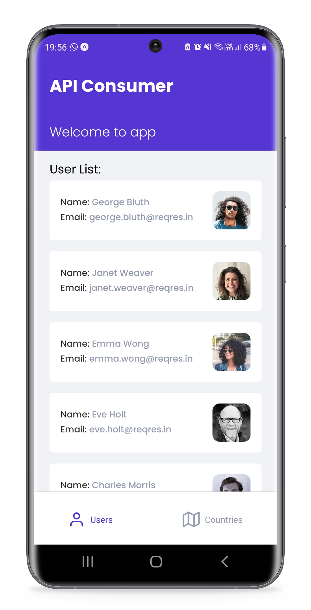
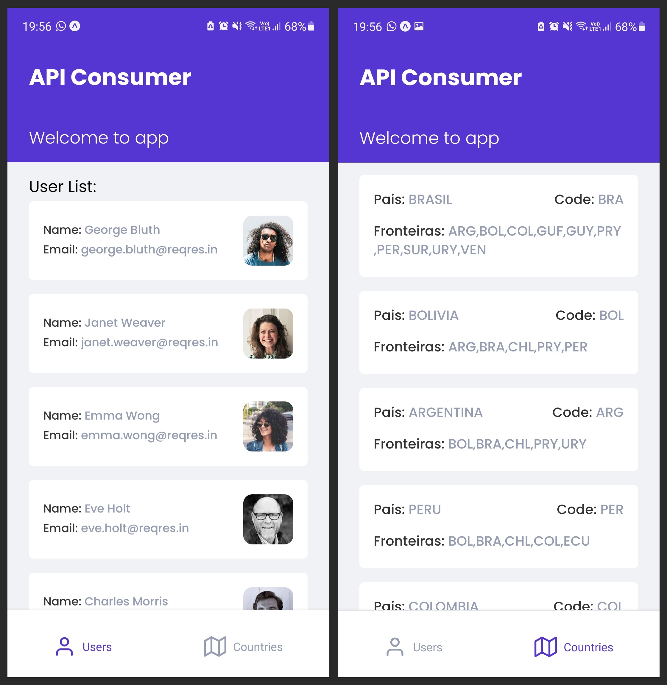

<div  align="center">
  
  <h1 align="center"> API Consumer </h1>

  
  
  
  

</div>

<div align="center">

  <br>

  <p align="center">
    <strong>
        <a href="#-layout">Layout</a> &nbsp;|&nbsp; 
    </strong>
    <strong>
        <a href="#-tecnologias">Tecnologias</a> &nbsp;|&nbsp; 
    </strong>
    <strong>
        <a href="#-como-executar-o-projeto">Executando</a> &nbsp;|&nbsp; 
    </strong>
  </p>

  <p align="center">
    
  </p>
</div>

## **🔖 Layout**

#### **Mobile**

  <br/>

  <div align="center">
    
  </div>

  <br/>

---

## **💻 Tecnologias**

#### **Mobile** ([React Native][react_native])

- **[Expo][expo]**
- **[React Native][react_native]**
- **[Typescript][typescript]**
- **[Styled Components][styled_components]**
- **[Axios][axios]**

#### **Extras**

- **[React Native Iphone X Helper][x_helper]**
- **[React Native Responsive Fontsize][responsive_fontsize]**

  > \* Veja o arquivo <kbd>[package.json](./package.json)</kbd>

<br/>

---

## **🚀 Como executar o projeto**

### Configurações Iniciais

Primeiro, você precisa ter o <kbd>[NodeJS](https://nodejs.org/en/download/)</kbd> instalado na sua máquina.

Após ter o **Node** instalado, Instale as dependências contidas nos arquivos `package.json` que se encontram na raíz do repositório. Para instalar as dependências, basta abrir o terminal no diretório e digitar o comando:

```sh
# Instalando as dependencias:
$ npm install

#  ou

$ yarn
```

> Veja a parte de **scripts {}** do arquivo <kbd>[package.json](./package.json)</kbd> para saber quais scripts estão disponíveis.

<br/>

### Executando o App

```sh
$ expo start
```

Em seguida instale o aplicativo do expo no seu smartphone e use o QRCode para abrir e visualizar o Api Consumer. Você pode optar por abrir no emulador tambem.

<br/>

<!-- Techs -->

[node]: https://nodejs.org/en/
[expo]: https://expo.dev
[react_native]: https://reactnative.dev
[typescript]: https://www.typescriptlang.org/
[styled_components]: https://styled-components.com
[axios]: https://github.com/axios/axios
[x_helper]: https://github.com/ptelad/react-native-iphone-x-helper
[responsive_fontsize]: https://github.com/heyman333/react-native-responsive-fontSize
[yarn]: https://classic.yarnpkg.com/en/docs/install/#debian-stable
